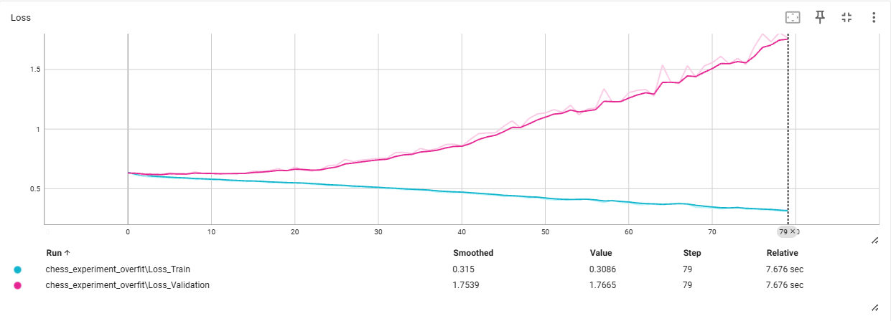
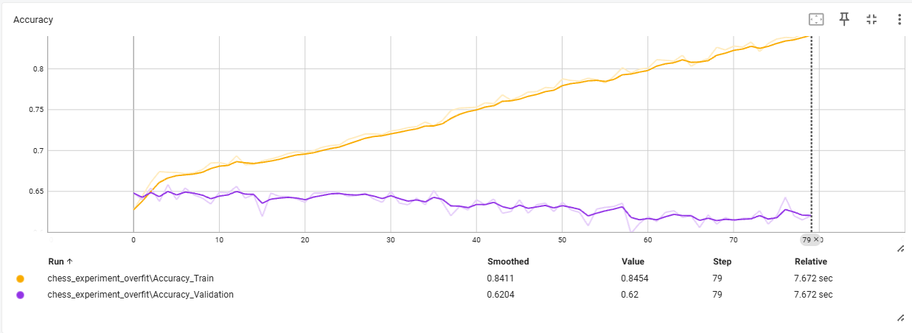
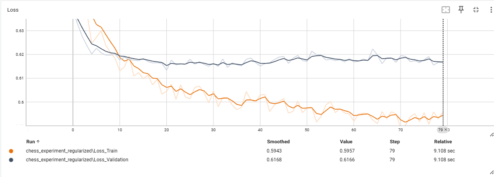
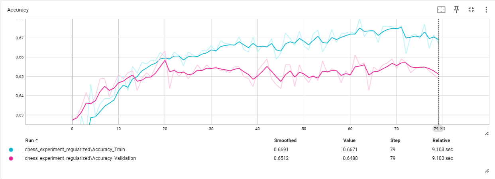

# Reporte de Entrenamiento: Red Neuronal vs Modelos Clásicos

Este documento resume los resultados del entrenamiento de una red neuronal en PyTorch para predecir el resultado de partidas de ajedrez, diagnosticando y mitigando el sobreajuste (overfitting), realizando un análisis estadístico riguroso de los hiperparámetros mediante un diseño factorial con repeticiones, y comparando estadísticamente el resultado final con tres modelos clásicos previamente entrenados: Random Forest, K-Nearest Neighbors y Decision Tree.

## 1. Diagnóstico de Overfitting con TensorBoard

**Análisis:**
- **¿Hubo overfitting inicial?:** Sí. 
- **¿Cómo se detectó?:** Al observar las curvas en TensorBoard, se puede apreciar que la pérdida de entrenamiento (`Train Loss`) continúa descendiendo hacia cero a lo largo de las épocas, mientras que la pérdida de validación (`Validation Loss`) llega a un punto mínimo y luego comienza a subir. Esto indica que la red estaba memorizando los datos de entrenamiento y perdiendo capacidad de generalización frente a datos nuevos.

## 2. Mitigación de Overfitting

**Técnicas aplicadas:**
- **Dropout (0.5 y 0.3):** Se añadieron capas de Dropout para "apagar" un porcentaje de neuronas aleatoriamente en cada iteración, forzando a la red a no depender de características específicas y aprender patrones más distribuidos.
- **Weight Decay (Regularización L2):** Se añadió al optimizador Adam (`weight_decay=1e-4`) para penalizar pesos muy grandes, evitando que la red se ajuste a ruidos en los datos.
- **Batch Normalization:** Para estabilizar el aprendizaje y mejorar la convergencia.

**Resultado:** 
Al observar la nueva curva en TensorBoard, la divergencia entre la pérdida de entrenamiento y validación se redujo significativamente. La pérdida de validación dejó de dispararse hacia arriba, logrando una mejor generalización, aunque revelando el límite de aprendizaje de nuestra arquitectura sobre estos datos tabulares.

---

## 3. Análisis Estadístico del Grid Search de Hiperparámetros

Antes de fijar la arquitectura final, se realizó una búsqueda sistemática de hiperparámetros para determinar cuáles influyen realmente en el rendimiento del modelo y cuál es la mejor combinación, en lugar de basarse únicamente en la configuración con mayor `val_accuracy` observada.

### 3.1 Diseño experimental

Se definió un **diseño factorial completo 2⁴**: 4 hiperparámetros con 2 niveles cada uno, lo que da 16 combinaciones posibles.

| Hiperparámetro | Nivel bajo | Nivel alto |
|---|---|---|
| `lr` | 0.0005 | 0.001 |
| `hidden_size` | 64 | 128 |
| `dropout` | 0.3 | 0.5 |
| `weight_decay` | 0.0001 | 0.001 |

Cada una de las 16 combinaciones se entrenó y registró en MLflow, calculando `val_accuracy` y `val_loss` sobre el conjunto de validación.

### 3.2 Del grid search simple al análisis con repeticiones

Un primer pase con **una sola corrida por combinación** mostró diferencias entre configuraciones, pero no permitía saber si esas diferencias eran un efecto real de los hiperparámetros o simple variabilidad del entrenamiento (inicialización de pesos, orden de los batches, máscaras de dropout). Para resolver esto, cada una de las 16 combinaciones se reentrenó con **5 semillas aleatorias distintas** (80 corridas en total), lo que permitió medir directamente el "ruido de fondo": cuánto varía `val_accuracy` en una *misma* configuración solo por cambiar la semilla.

- **Ruido de fondo estimado** (desviación estándar entre semillas, misma config): ≈ 0.0067 (0.67 puntos porcentuales)
- **Error estándar de un efecto principal** (con 5 semillas): ≈ 0.0015 (0.15 puntos porcentuales)

### 3.3 Efectos principales

El efecto de cada hiperparámetro se calculó como la diferencia entre el `val_accuracy` promedio en su nivel alto y en su nivel bajo (promediando sobre las demás variables y las 5 semillas). Un efecto se considera distinguible del ruido si supera aproximadamente 2 veces su error estándar.

| Hiperparámetro | Efecto sobre val_accuracy | ¿Significativo? |
|---|---|---|
| **`dropout`** | −0.41 pp (0.3 mejor que 0.5) | **Sí** |
| **`hidden_size`** | +0.43 pp (128 mejor que 64) | **Sí** |
| `weight_decay` | +0.04 pp | No |
| `lr` | ≈ 0.00 pp | No |

Las interacciones de segundo orden entre pares de hiperparámetros (por ejemplo `hidden_size × dropout`) también se evaluaron y ninguna resultó distinguible del ruido de entrenamiento.

### 3.4 Mejor combinación encontrada

| Hiperparámetro | Valor |
|---|---|
| `lr` | 0.0005 |
| `hidden_size` | 128 |
| `dropout` | 0.3 |
| `weight_decay` | 0.001 |
| **val_accuracy promedio (5 semillas)** | **0.6577** |

Esta combinación fue consistentemente la de mejor rendimiento promedio y la que quedó fijada en `params.yaml` para el modelo final.

### 3.5 Conclusiones del análisis

1. **`dropout` y `hidden_size` importan de verdad**: son los únicos dos hiperparámetros cuyo efecto sobre `val_accuracy` supera el ruido propio del entrenamiento. Reducir el dropout de 0.5 a 0.3 y aumentar el `hidden_size` de 64 a 128 mejora el rendimiento de forma consistente.
2. **`lr` y `weight_decay`, en el rango probado, no importan**: sus efectos son indistinguibles de la variabilidad por semilla aleatoria, por lo que se pueden fijar en cualquiera de los dos valores explorados sin pérdida real de rendimiento.
3. **El ruido de entrenamiento es comparable al efecto de los hiperparámetros**: la desviación estándar entre semillas (~0.67 pp) es del mismo orden que las diferencias entre las mejores configuraciones del grid, lo que confirma que evaluar con una sola corrida por configuración —como se hizo en el primer pase— es insuficiente para elegir hiperparámetros con confianza estadística.
4. **El techo de rendimiento de esta arquitectura ronda 65-66%** de `val_accuracy`, coherente con lo que luego se observó al comparar contra los modelos clásicos (Sección 4): el cuello de botella no está en el ajuste fino de hiperparámetros, sino en la señal disponible en los datos.

---

## 4. Comparación Estadística (Test de McNemar)

Comparamos las predicciones en el conjunto de prueba (Test Set) para verificar si las diferencias en precisión (*Accuracy*) entre la Red Neuronal (NN) y los modelos clásicos son estadísticamente significativas (p-value < 0.05).

**Precisión de la Red Neuronal (NN):** `64.88%`

### Red Neuronal vs Random Forest
- **Accuracy Random Forest:** `65.19%`
- **P-Value:** `0.88730`
- **Interpretación:** **No hay diferencia estadísticamente significativa**. La Red Neuronal logró un rendimiento estadísticamente equivalente al del Random Forest. Ambos modelos extrajeron la misma cantidad de información útil de estos datos.

### Red Neuronal vs Decision Tree
- **Accuracy Decision Tree:** `60.04%`
- **P-Value:** `0.00921`
- **Interpretación:** Existe una diferencia **estadísticamente significativa**. La Red Neuronal superó al Árbol de Decisión tradicional, logrando capturar patrones más complejos.

### Red Neuronal vs K-Nearest Neighbors
- **Accuracy K-NN:** `60.97%`
- **P-Value:** `0.01409`
- **Interpretación:** Existe una diferencia **estadísticamente significativa**. La Red Neuronal fue consistentemente mejor que el modelo K-NN para predecir el resultado de las partidas.

---

## 5. Conclusión Final

**¿La red neuronal realmente mejoró algo o los modelos clásicos eran suficientes para este problema?**

La conclusión tras reentrenar y evaluar rigurosamente es muy reveladora: **La Red Neuronal superó estadísticamente a modelos más simples (Decision Tree y K-NN), y logró empatar (no hay diferencia significativa) con el ensamble clásico más robusto (Random Forest).**

**¿Qué significa esto para el proyecto?**
1. **El límite de los datos:** Tanto la Red Neuronal (~64.9%) como el Random Forest (~65.2%) chocaron contra una pared en la precisión. Esto nos indica que las características actuales del dataset no contienen suficiente "señal" predictiva para adivinar al ganador de una partida de ajedrez con mayor exactitud (el ajedrez es altamente complejo y factores como el ranking o la apertura, por sí solos, no son determinantes absolutos).
2. **Costo-Beneficio:** Aunque la Red Neuronal logró igualar al mejor modelo clásico, el esfuerzo computacional y de diseño (diagnosticar overfitting, aplicar Dropout, calibrar capas) fue considerable. Para datos tabulares de este tipo, el **Random Forest** suele ser la opción más pragmática al ofrecer el máximo rendimiento "fuera de la caja".

El ejercicio cumplió excelentemente su objetivo analítico: demostró empíricamente (vía Test de McNemar y TensorBoard) cómo comparar formalmente un modelo de *Deep Learning* contra *Machine Learning* clásico, probando que modelos totalmente distintos pueden converger exactamente en el mismo límite de aprendizaje dictado por la calidad de los datos.